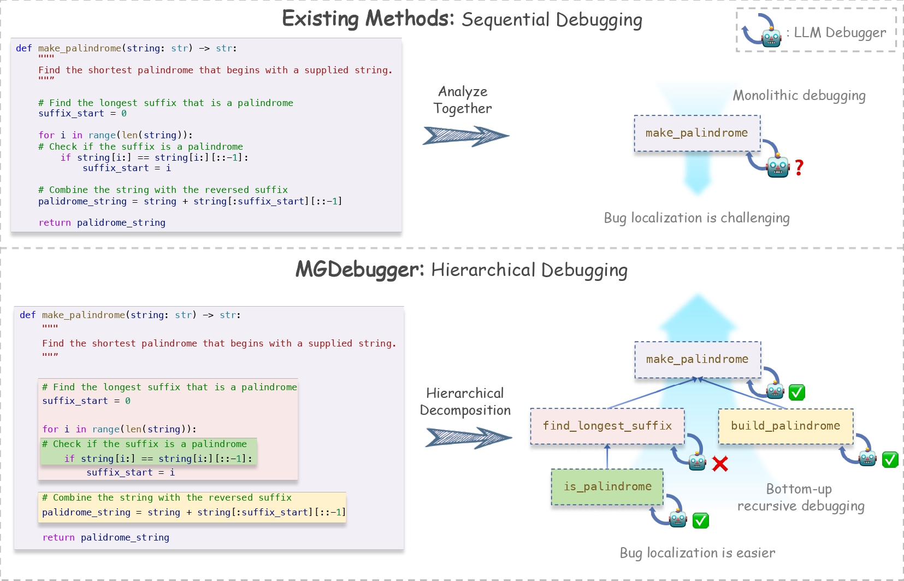
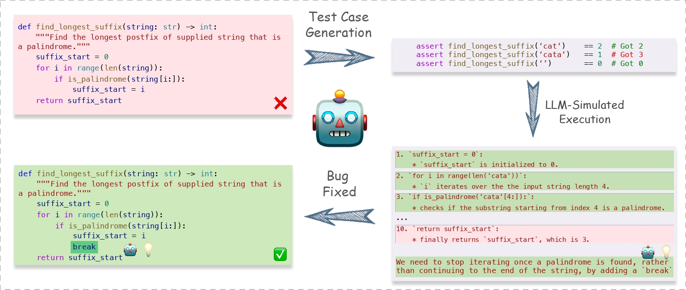

<div align="center">

# MGDebugger: Multi-Granularity LLM Debugger

[](https://opensource.org/licenses/MIT)
[](https://www.python.org/)

</div>

## Table of Contents

- [Introduction](#introduction)
- [Getting Started](#getting-started)
  - [Prerequisites](#prerequisites)
  - [Configuring the VLLM Server](#configuring-the-vllm-server)
- [Usage](#usage)
  - [Running the Demo](#running-the-demo)
  - [Running Experiments](#running-experiments)
  - [Log Management](#log-management)
- [Performance](#performance)
- [Contributing](#contributing)

## Introduction

MGDebugger is a hierarchical LLM code debugging method designed to isolate, identify, and resolve errors at various levels of granularity. Using a hierarchical bottom-up debugging approach, MGDebugger systematically progresses from individual subfunctions to the overall system, enabling precise error detection and correction.

With MGDebugger, developers can efficiently debug complex codes and functions by performing granular analysis, reducing debugging time, and improving the success rate of resolving complex issues.

<div align="center">
    
    <p>MGDebugger System Architecture Overview</p>
</div>

<div align="center">
    
    <p>Subfunction Debugging Module</p>
</div>

## Getting Started

### Prerequisites

Before running MGDebugger, ensure your environment meets the following requirements:

- **Python**: Version 3.8 or later.
- **vllm**: Version 0.6.0 or later. Required for model loading and inference. You can follow the [official vllm installation guide](https://github.com/vllm-project/vllm) to set it up.
- **Additional dependencies**: Install all necessary Python packages using the following command:

    ```bash
    pip install -r requirements.txt
    ```

### Configuring the VLLM Server

To launch the VLLM server with the `DeepSeek-Coder-V2-Lite-Instruct` model, execute the following command:

```bash
python -m vllm.entrypoints.openai.api_server \
    --model deepseek-ai/DeepSeek-Coder-V2-Lite-Instruct \
    --trust-remote-code \
    --dtype auto \
    --api-key token-abc123s \
    --port 18889
```

This will initialize the model and start the server on port `18889`.

## Usage

### Running the Demo

We've prepared a demo code snippet to showcase MGDebugger's debugging capabilities. You can run the demo by executing the following command after starting the VLLM server:

```bash
python demo.py
```

### Running Experiments

Once the VLLM server is up and running, start MGDebugger by executing:

```bash
python main.py
```

> **Tip**: You can modify the `MODEL` and `input_seeds` parameters in the `config.py` file to test different models and input configurations.

### Log Management

MGDebugger automatically stores all debugging and error logs in the `output_data` directory. You can review these logs to gain deeper insights into debugging details and performance analysis.

## Performance

The table below highlights the performance of different methods compared to the baseline (No-Debugging) on the HumanEval and MBPP datasets using the DeepSeek-Coder-V2-Lite model.

| Method                        | HumanEval Acc. (%) | Δ Acc. (%) | HumanEval RSR (%) | MBPP Acc. (%) | Δ Acc. (%) | MBPP RSR (%) |
|------------------------------|--------------------|------------|-------------------|---------------|------------|--------------|
| No-Debugging                  | 76.8               | --         | --                | 67.2          | --         | --           |
| Simple Feedback               | 82.3               | +5.5       | 23.7              | 69.4          | +2.2       | 6.7          |
| Self-Edit                     | 82.9               | +6.1       | 26.3              | 71.2          | +4.0       | 12.2         |
| LDB (Block)                   | 84.1               | +7.3       | 31.6              | 74.0          | +6.8       | 20.7         |
| Self-Debugging (Expl.)        | 87.2               | +10.4      | 44.7              | 73.4          | +6.2       | 18.9         |
| Self-Debugging (Trace)        | 86.0               | +9.2       | 39.5              | 72.6          | +5.3       | 16.5         |
| Reflexion                     | 90.9               | +14.1      | 60.5              | 76.6          | +9.4       | 28.7         |
| **Our Approach**              | **94.5**           | **+17.7**  | **76.3**          | **80.0**      | **+12.8**  | **39.0**     |

Our approach achieved the highest accuracy on both HumanEval and MBPP datasets, with a remarkable improvement of +17.7% and +12.8% in accuracy over the baseline, respectively. The Repair Success Rate (RSR) was also significantly higher than other methods, demonstrating the effectiveness of our debugging strategy in fixing diverse code issues.

## Contributing

We warmly welcome contributions to MGDebugger! If you have suggestions, improvements, or bug reports, feel free to open an issue or submit a pull request on our GitHub repository. We appreciate your feedback and look forward to building MGDebugger together with the community!